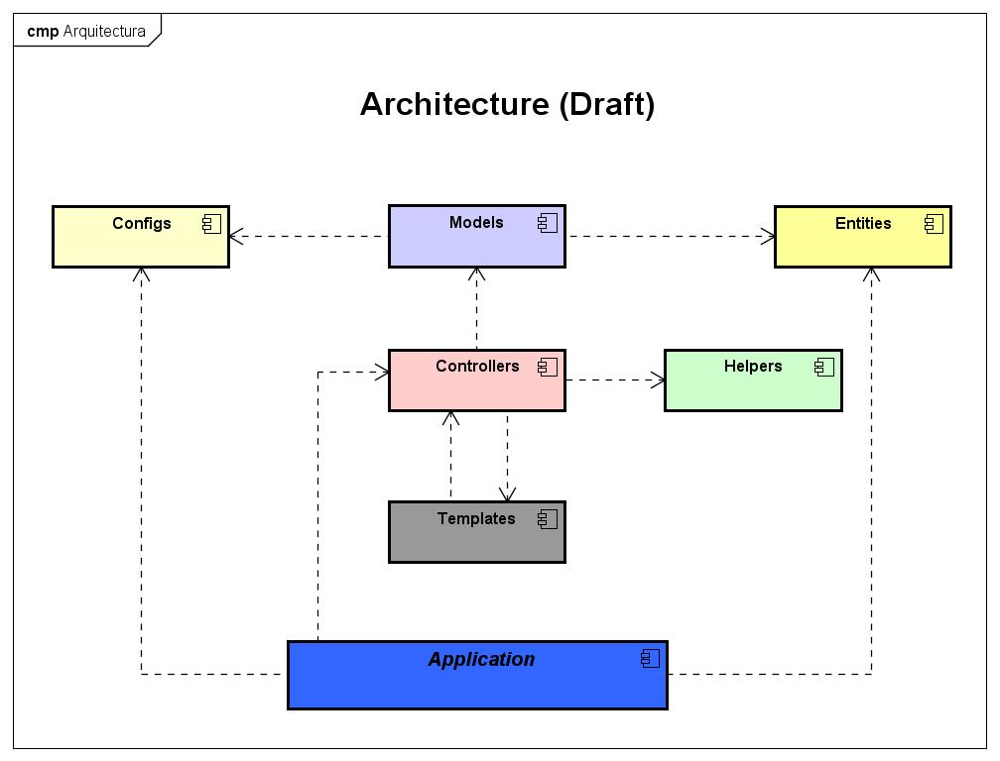
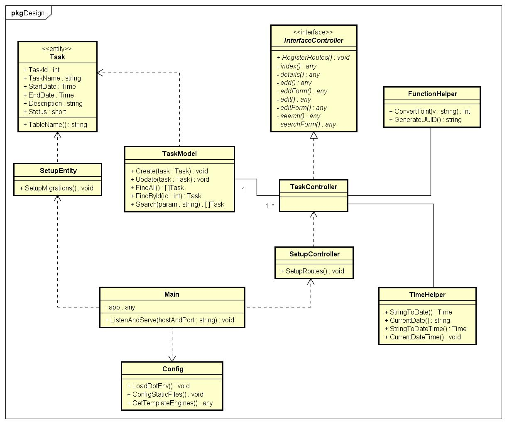

# Golang App - Fiber Framework

## Architecture

- Config
- Helpers: functions to Help
- Entities: Represents a table ina database
- Models: Represents the Business Logic
- Controllers: Represents all controllers or handlers
- Templates: All Html templates for rendering data
- Application: Main Layer that call all other layers

## Design

- Models: Operations: Create, Read, Find, ...
- Interface for Controllers
- SetupController: Load all routes
- Configs: Env, Logs, Template Engines
- Main: Loadd all components to run application

- App: Main class or file, that call all controllers, migrations, configs and template engines

